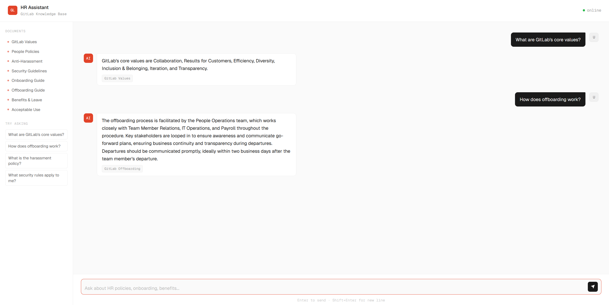

# Enterprise RAG Knowledge Assistant

A local RAG system that answers HR and policy questions from company documentation using a local LLM — no external API needed.

## Demo



## How It Works
```
Question
    ↓
Embedding (multilingual-e5-small)
    ↓
ChromaDB Vector Search
    ↓
Qwen 2.5-1.5B generates answer
    ↓
Answer + Sources
```

## Output Example

**Q: What are GitLab's core values?**
> GitLab's core values are Collaboration, Results for Customers, Efficiency, Diversity, Inclusion & Belonging, Iteration, and Transparency.
>
> Source: GitLab Values

**Q: How does offboarding work?**
> The offboarding process is facilitated by the People Operations team, which works closely with Team Member Relations, IT Operations, and Payroll...
>
> Source: GitLab Offboarding

## Stack

| Component | Tool |
|---|---|
| LLM | Qwen 2.5-1.5B-Instruct (local) |
| Embeddings | intfloat/multilingual-e5-small |
| Vector DB | ChromaDB |
| API | FastAPI |
| Documents | GitLab Handbook (9 PDFs) |

## Setup
```bash
pip install fastapi uvicorn chromadb sentence-transformers transformers torch
```
```bash
uvicorn app:app --host 0.0.0.0 --port 8000
```

Open `http://localhost:8000`

## Features

- Answers strictly from provided documents
- Shows source document for every answer
- Runs fully local — no API keys needed
- Clean chat interface
